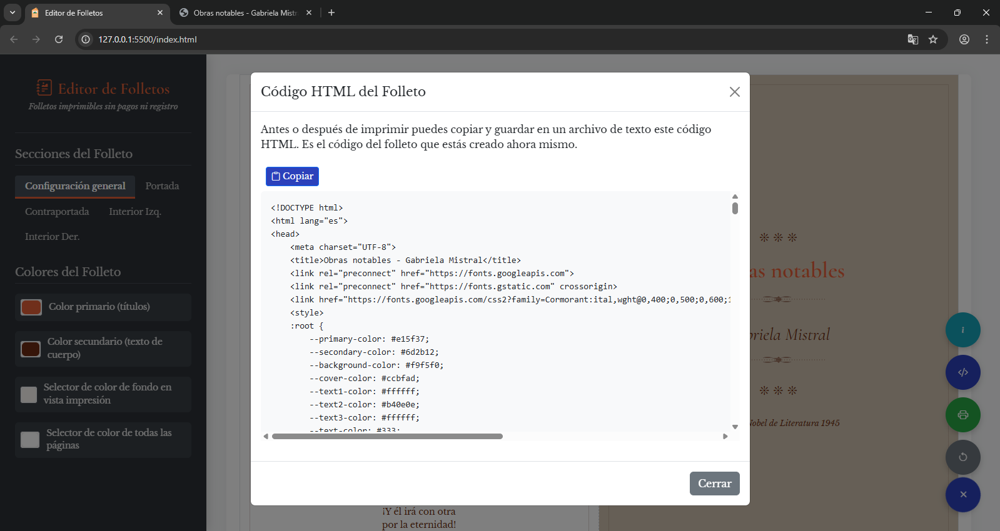

# Editor de Folletos

Una herramienta web gratuita y de código abierto para crear folletos de manera simple y rápida. Diseña y personaliza folletos tipo díptico para imprimir, sin necesidad de registrarte ni pagar.

## Screenshots

<div align="center">
  
  
</div>

## 🌟 Características

- ✅ **Diseño Simplificado**: Crea folletos con aspecto simple pero elegante en pocos minutos, imprime y dobla
- ✅ **Fácil de Usar**: Interfaz intuitiva sin necesidad de conocimientos de diseño
- ✅ **Personalizable**: Controla colores, textos, fuentes y tamaños
- ✅ **Vista Previa en Tiempo Real**: Visualiza cambios inmediatamente
- ✅ **Sin Registro ni pagos**: No requiere crear cuentas ni proporcionar datos personales
- ✅ **Sin Instalación**: Funciona directamente en tu navegador
- ✅ **Completamente Gratuito**: Sin costos ocultos ni límites de uso
- ✅ **Código Abierto**: Revisa, modifica y mejora el código libremente

## 📋 Instrucciones de Uso

1. **Botón flotante de opciones**: Da clic en el botón flotante con el signo +. Se desplegaran varios botones:
   - **Información**: Entrega información sobre la aplicación
   - **Generar HTML**: Te permite guardar un copia del folleto que estás haciendo en HTML
   - **Vista de Impresión**: Te lleva a la pantalla de impresión
   - **Reiniciar**: Restablece todos los cambios que hayas hecho para empezar de nuevo
   
2. **Personalización**: Usa las pestañas en el panel izquierdo para cambiar:
   - Colores generales y de fondo
   - Título, autor y detalles de portada
   - Texto y formato de las diferentes páginas
   
3. **Guardado**: La aplicación guarda automáticamente tu progreso en el navegador

4. **Impresión**: Haz clic en el botón "Vista de Impresión" y utiliza la función de impresión de tu navegador

### 🖨️ Consejos para Imprimir

Para obtener los mejores resultados al imprimir:

- Usa papel tipo carta (Letter)
- Selecciona orientación horizontal (Landscape)
- Activa la impresión a doble cara
- Configura los márgenes en "Ninguno"
- Activa "Imprimir gráficos de fondo"

## 🛠️ Tecnologías Utilizadas

- **HTML5/CSS3**: Estructura y estilos responsive
- **JavaScript (ES6+)**: Lógica de la aplicación con módulos ES6
- **Bootstrap 5**: Framework de componentes para la interfaz
- **LocalStorage API**: Guardado automático del progreso
- **Arquitectura MVC**: Organización modular del código

## 📐 Arquitectura del Software

El proyecto está estructurado siguiendo una arquitectura Modelo-Vista-Controlador (MVC) modernizada:

```
js/
├── app.js                    # Punto de entrada principal
├── services/
│   ├── StorageService.js     # Gestión del almacenamiento local
│   └── PdfService.js         # Generación de HTML y vista previa
├── models/
│   └── BrochureModel.js      # Modelo de datos del folleto
├── ui/
│   ├── UIManager.js          # Gestión central de la UI
│   ├── ColorManager.js       # Gestión de colores
│   ├── TextManager.js        # Gestión de textos
│   └── ModalManager.js       # Gestión de modales
└── utils/
    └── DOMUtils.js           # Utilidades para el DOM
```

## 📄 Licencia

Este proyecto está licenciado bajo la [Licencia MIT](LICENSE) - consulta el archivo LICENSE para más detalles.

---